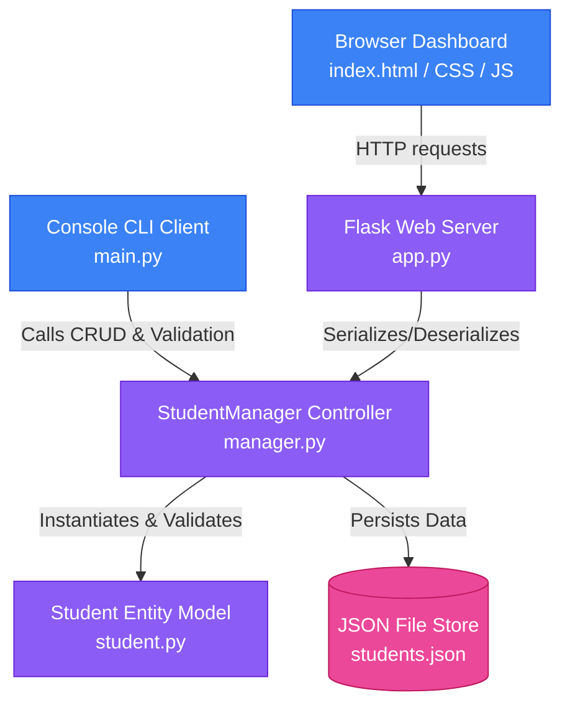

# Technical Documentation: Student Management System (SMS)

This document provides a comprehensive technical overview of the Student Management System (SMS), detailing its architecture, database design, API design, frontend and backend implementations, testing suite, and performance analysis.

---

## 1. Project Overview

The **Student Management System (SMS)** is a lightweight, responsive, full-stack application developed using Python 3 and modern web technologies. It provides a dual-interface utility for managing student demographic data, course assignments, and academic performance:

1. **Console-based Command-Line Interface (CLI)**: Optimized for keyboard-oriented, rapid data entry and direct administrative scripting.
2. **Web Portal Dashboard**: A visually striking, responsive frontend leveraging glassmorphic design and client-side logic to interact with the backend asynchronously.

Both interfaces share a common business logic and persistence layer, ensuring real-time consistency across all clients.

---

## 2. System Architecture & Component Design

The application follows a modular MVC (Model-View-Controller) inspired architecture:



### 2.1 Core Modules

*   **[student.py](file:///e:/upskill/student_management_system/student.py)** (Model Layer): Defines the `Student` object structure. It is responsible for encapsulating student attributes, calculating fields dynamically (e.g., GPA letter grade and pass/fail status), and executing input validation.
*   **[manager.py](file:///e:/upskill/student_management_system/manager.py)** (Controller/Data Layer): Defines the `StudentManager` class, which handles collections of `Student` objects. It is responsible for executing CRUD (Create, Read, Update, Delete) operations, sorting algorithms, and file serialization.
*   **[main.py](file:///e:/upskill/student_management_system/main.py)** (CLI Presentation Layer): Standard Python script running a menu-driven keyboard terminal loop. It parses command-line inputs and visualizes tabular outputs.
*   **[app.py](file:///e:/upskill/student_management_system/app.py)** (Web Routing & REST API Layer): Starts a Flask server that provides static routing for the dashboard web assets and constructs REST API endpoints for database interaction.
*   **[static/css/style.css](file:///e:/upskill/student_management_system/static/css/style.css)** & **[static/js/app.js](file:///e:/upskill/student_management_system/static/js/app.js)** (Web Client Layer): Handles CSS glassmorphism animations and manages dynamic client-side scripting (asynchronous AJAX calls, real-time filtering, layout updates, validation, and notification alerts).

---

## 3. Data Model & Database Schema

The database relies on a file-based JSON storage located at `data/students.json`. The model translates directly into Python dictionaries for transmission.

### 3.1 Student Entity Schema

The `Student` model consists of the following attributes:

| Field Name | Type | Description | Validation Constraints |
| :--- | :--- | :--- | :--- |
| `student_id` | `String` | Unique identifier key | Non-empty, alphanumeric, unique globally |
| `name` | `String` | Full name of the student | Non-empty string |
| `age` | `Integer` | Student's age | Must be a valid integer greater than `0` |
| `gender` | `String` | Student's gender | Non-empty string (e.g., Male, Female, Other) |
| `course` | `String` | Registered course/department | Non-empty string |
| `marks` | `Float` | Academic scores | Must be a numeric value between `0.0` and `100.0` (inclusive) |
| `email` | `String` | Student's email address | Must match regular expression format constraints |
| `grade` | `String` | **(Property)** Letter grade computed on Marks | Automatically calculated from `marks` |
| `status` | `String` | **(Property)** Pass/Fail evaluation | Automatically calculated: "Pass" if `marks` &ge; 50, else "Fail" |

### 3.2 Verification Rules
The constructor of the `Student` object automatically validates properties before memory allocation:
1.  **Email Pattern Matching**: A strict regular expression: `^[a-zA-Z0-9._%+-]+@[a-zA-Z0-9.-]+\.[a-zA-Z]{2,}$` ensures structure correctness.
2.  **Range Bounds Check**: Enforces $0 \le marks \le 100$.
3.  **Entity Validation during Update**: The `StudentManager` builds a transient `Student` model to run validations on updated fields before modifying the state of the target record.

### 3.3 Dynamic Fields Computation Rules
*   **Grade Calculation**:
    $$Grade = \begin{cases} 
      A & \text{if } marks \ge 90 \\
      B & \text{if } 80 \le marks < 90 \\
      C & \text{if } 70 \le marks < 80 \\
      D & \text{if } 60 \le marks < 70 \\
      E & \text{if } 50 \le marks < 60 \\
      F & \text{if } marks < 50
    \end{cases}$$
*   **Status Calculation**:
    $$Status = \begin{cases} 
      \text{"Pass"} & \text{if } marks \ge 50 \\
      \text{"Fail"} & \text{if } marks < 50
    \end{cases}$$

---

## 4. REST API Endpoint Catalog

The Flask backend exposes JSON endpoints for interaction. All endpoint payloads consume and return JSON format.

### 4.1 GET `/api/students`
Fetches all student records in the JSON datastore.
*   **Query Parameters**:
    *   `sort` (optional): Sort fields (`name` or `marks`).
    *   `reverse` (optional): Boolean (`true` or `false`) defining direction.
*   **Success Response**: `200 OK`
    ```json
    [
      {
        "student_id": "STD1001",
        "name": "Jane Doe",
        "age": 20,
        "gender": "Female",
        "course": "Computer Science",
        "marks": 92.5,
        "email": "jane.doe@example.com",
        "grade": "A",
        "status": "Pass"
      }
    ]
    ```

### 4.2 POST `/api/students`
Creates and registers a new student record.
*   **Payload Requirements**: All fields must be present and validate successfully.
*   **Request Example**:
    ```json
    {
      "student_id": "STD1002",
      "name": "John Smith",
      "age": 22,
      "gender": "Male",
      "course": "Mathematics",
      "marks": 48.0,
      "email": "john.smith@example.com"
    }
    ```
*   **Success Response**: `201 Created` returning the complete serialized entity.
*   **Error Response**: `400 Bad Request` if validations fail or ID already exists.
    ```json
    {
      "error": "Student ID 'STD1002' already exists."
    }
    ```

### 4.3 GET `/api/students/<student_id>`
Fetches details of a specific student by ID.
*   **Success Response**: `200 OK`
*   **Error Response**: `404 Not Found` if ID does not exist.
    ```json
    {
      "error": "Student with ID 'STD9999' not found."
    }
    ```

### 4.4 PUT `/api/students/<student_id>`
Updates fields of an existing student. Partial payloads are accepted; omitted properties will retain their existing values.
*   **Request Example**:
    ```json
    {
      "marks": 85.0,
      "email": "new.email@example.com"
    }
    ```
*   **Success Response**: `200 OK` returning the updated record.
*   **Error Response**: `400 Bad Request` if the updated schema triggers validation faults.

### 4.5 DELETE `/api/students/<student_id>`
Erases a record from the database.
*   **Success Response**: `200 OK`
    ```json
    {
      "success": "Student with ID 'STD1002' has been deleted."
    }
    ```

### 4.6 GET `/api/stats`
Retrieves statistical metadata computed dynamically over the entire database.
*   **Success Response**: `200 OK`
    ```json
    {
      "total_students": 5,
      "average_marks": 75.83,
      "course_distribution": {
        "Computer Science": 3,
        "Mathematics": 2
      }
    }
    ```

---

## 5. Web Interface Design

The Web Portal dashboard is constructed using custom Vanilla CSS variables with glassmorphism layout patterns.

### 5.1 Glassmorphic Visual Styling
*   **Frosted Glass Effect**: Constructed using HSL tailored translucent backgrounds (`rgba(255, 255, 255, 0.05)`), saturated backdrop filters (`backdrop-filter: blur(16px) saturate(180%)`), and glowing borders.
*   **Visual Highlights**: Subtle dynamic elements (e.g. background circles sliding with slow animations) provide depth, while interactive elements respond smoothly to user input.
*   **Dynamic Badges**: Marks and status fields use color-coded badges based on values:
    *   High marks (&ge; 80): Emerald Green (`--accent-green`)
    *   Medium marks (40-79): Royal Blue (`--accent-blue`)
    *   Low marks (< 40): Vivid Red (`--accent-red`)

### 5.2 Frontend Client-Side Scripting
All API integrations are implemented in `app.js` using standard JavaScript `async/await` syntax:
1.  **State Synchronization**: Maintains local `students` array state to avoid redundant round-trip API queries during display.
2.  **Instant Filter Search**: Matches search queries against ID, name, course, and email instantaneously on the client side.
3.  **Modal Controllers**: Opens edit/add modal frames, pre-populating fields and blocking ID editing for existing records.
4.  **Client-Side Validator**: Validates fields and highlights inputs in red before making network requests to reduce network overhead.
5.  **Toast Notification System**: Triggers floating feedback alerts (Success/Info/Error) that slide in from the bottom right and self-dismiss after 4 seconds.

---

## 6. Automated Testing & Verification Suite

Automated testing is implemented in `test_logic.py` using Python's native `unittest` module.

### 6.1 Isolated Testing Strategy
*   **Fixture Isolation**: The `setUp` method spawns a temporary file using `tempfile.NamedTemporaryFile` for every test process and writes clean structural content `[]` into it.
*   **Resource Cleanup**: The `tearDown` method guarantees physical file destruction after each test, preventing database pollution.

### 6.2 Test Coverage Details

The test suite covers:
1.  **Creation Logic**: Validates model parsing, grade calculation bounds, and pass/fail thresholds.
2.  **Demographics and Type Checking**: Validates exception rules for non-integer age values, non-numeric marks, and empty strings.
3.  **Invalid Email Boundaries**: Verifies email formatting rules against missing domains, multiple `@` symbols, spaces, and invalid characters.
4.  **CRUD Integrity**: Checks database actions: ID conflict prevention, search lookups, partial record updates, validation enforcement during updates, and deletion mapping.
5.  **Alphabetical and Numerical Sorting**: Confirms correct sort orders for names and marks.

---

## 7. Performance & Complexity Analysis

Let $N$ represent the total number of student records stored in the database.

| Operation | Time Complexity | Memory Complexity | Notes |
| :--- | :--- | :--- | :--- |
| **Search by ID** | $\mathcal{O}(1)$ | $\mathcal{O}(1)$ | Dictionary lookup by unique student ID keys. |
| **Add Student** | $\mathcal{O}(N)$ | $\mathcal{O}(N)$ | Initial $\mathcal{O}(1)$ duplicate check, followed by serialization of $N$ objects back to the JSON file. |
| **Update Student** | $\mathcal{O}(N)$ | $\mathcal{O}(N)$ | In-memory modification is $\mathcal{O}(1)$, followed by $\mathcal{O}(N)$ disk write back. |
| **Delete Student** | $\mathcal{O}(N)$ | $\mathcal{O}(N)$ | In-memory dictionary deletion is $\mathcal{O}(1)$, followed by $\mathcal{O}(N)$ disk write back. |
| **Sorting** | $\mathcal{O}(N \log N)$ | $\mathcal{O}(N)$ | Uses Timsort, Python's default sorting algorithm. |

---

## 8. Deployment & Execution Guide

### 8.1 Setup Environment
Initialize virtual environment and fetch requirements:
```bash
# Navigate to codebase directory
cd student_management_system

# Setup virtual environment
python -m venv venv
source venv/bin/activate  # On Windows: .\venv\Scripts\activate

# Install Flask dependencies
pip install -r requirements.txt
```

### 8.2 Execution
*   **Run CLI Menu**:
    ```bash
    python main.py
    ```
*   **Start Flask Server**:
    ```bash
    python app.py
    ```
    Access the dashboard at [http://127.0.0.1:5000](http://127.0.0.1:5000).
*   **Run Test Suite**:
    ```bash
    python -m unittest test_logic.py
    ```
